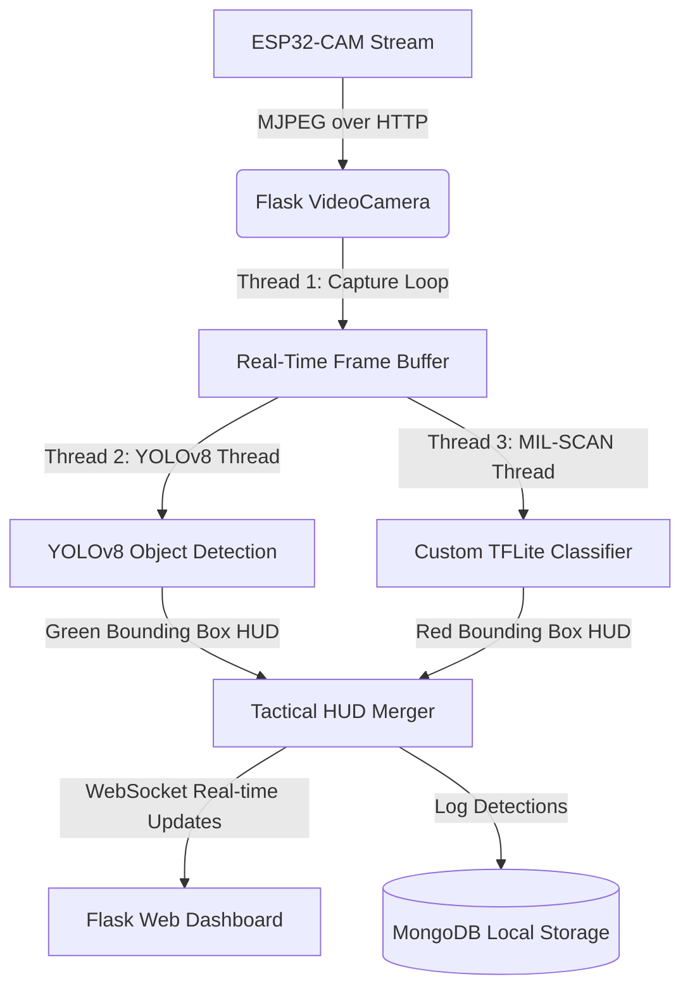

# 🛡️ AEGIS-1: Military Drone Surveillance & Threat Detection System

[](https://www.python.org/)
[](https://flask.palletsprojects.com/)
[](https://github.com/ultralytics/ultralytics)
[](https://www.mongodb.com/)

**AEGIS-1** is a high-performance, real-time military surveillance and tactical threat classification platform. Designed for edge deployment on drone systems, AEGIS-1 combines a robust **Flask + SocketIO** dashboard with a dual-model AI inference pipeline, streaming live video from low-power **ESP32-CAM** microcontrollers, detecting general objects, and executing deep tactical sweeps to classify high-value military assets.

---

## 🏗️ System Architecture



---

## 🌟 Key Features

*   **🎬 Multi-Threaded Video Pipeline:** Uses three dedicated concurrent execution threads (Capture, YOLOv8, and TFLite MIL-SCAN) with thread-safe locking mechanisms (`ai_lock`) to achieve ultra-low latency streams without UI stutter.
*   **🎯 Dual-Model AI Intelligence:**
    *   **YOLOv8 (Pre-trained):** Detects general operational objects in real-time at scale.
    *   **MIL-SCAN (Custom TFLite):** Performs targeted military-grade target classification.
*   **📟 Live Tactical HUD:** Features a dynamic, dark-themed dashboard displaying high-speed video overlays, system FPS counters, total target tallies, and detailed lists of live threat classifications.
*   **🔬 Deep-Scan Analysis Mode:** Allows analysts to temporarily pause live streams to upload captured drone imagery for a high-definition static analysis.
*   **💾 Tactical Logging:** Automatic local ingestion of threat types, confidence scores, and timestamps into **MongoDB** for intelligence post-processing.

---

## 🧠 Dual-Model Detection Spectrum

AEGIS-1 runs concurrent detectors to maximize battleground situational awareness:

| AI Engine | Model Type | Targeting Framework | Target/Threat Classes |
| :--- | :--- | :--- | :--- |
| **YOLOv8** | PyTorch (`yolov8n.pt`) | Standard Object Detection | Persons, general vehicles, standard equipment |
| **MIL-SCAN** | TensorFlow Lite (`model.tflite`) | Custom Military Classification | `helicopter`, `military_plane`, `military_tank`, `military_vehicle`, `missile` |

---

## 📂 Project Structure

```text
├── models/
│   └── model.tflite          # Custom MIL-SCAN TFLite classifier model
├── static/
│   ├── css/
│   │   └── style.css         # Tactical UI stylesheets
│   ├── js/
│   │   └── main.js           # Real-time WebSocket connection & UI management
│   └── uploads/              # Storage folder for Analyst Upload scans
├── templates/
│   ├── index.html            # Main Live HUD dashboard UI
│   └── analysis.html         # Analyst deep-scan upload UI
├── app.py                    # Main Flask application & core AI pipeline
├── requirements.txt          # Python virtual environment dependencies
└── .gitignore                # Optimized Git ignore file
```

---

## 🛠️ Requirements & Installation

Ensure you have Python 3.8+ and MongoDB installed on your system.

### 1. Clone & Navigate to Repository
```bash
git clone https://github.com/YOUR-USERNAME/aegis-1-surveillance.git
cd aegis-1-surveillance
```

### 2. Set Up Virtual Environment
Activate your existing `yolo_env` virtual environment, or create a new one:
```bash
# To create a new virtual environment
python -m venv yolo_env

# To activate on Windows:
yolo_env\Scripts\activate

# To activate on Linux/macOS:
source yolo_env/bin/activate
```

### 3. Install Core Dependencies
```bash
pip install -r requirements.txt
```

---

## ⚙️ Configuration

### 1. MongoDB Database
Ensure your MongoDB daemon is running locally on port `27017`. AEGIS-1 will automatically create the database `drone_surveillance` and collection `detections` upon first startup.
*   **Windows**: Start MongoDB service via `services.msc` or run `mongod`.

### 2. ESP32-CAM Stream
Open `app.py` and modify the `STREAM_URL` configuration to point to your active ESP32-CAM's IP address:
```python
# app.py (Line 66)
STREAM_URL = "http://192.168.169.70:81/stream"
```
*(You can also dynamically change this IP stream URL directly from the Web UI control panel).*

---

## 🚀 Running the Platform

1. **Activate your environment:**
   ```bash
   yolo_env\Scripts\activate
   ```

2. **Launch the Flask application server:**
   ```bash
   python app.py
   ```

3. **Open the platform HUD in your browser:**
   Navigate to: **`http://localhost:5000`**

---

## 🛡️ License

This project is developed for educational and tactical academic research purposes. All proprietary models belong to the respective research groups.
